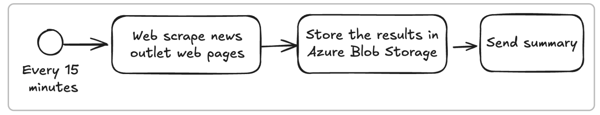
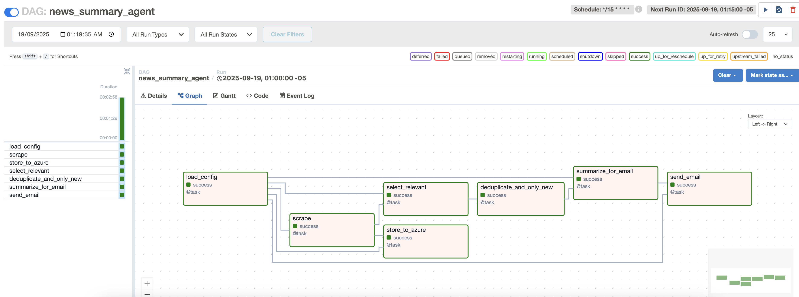
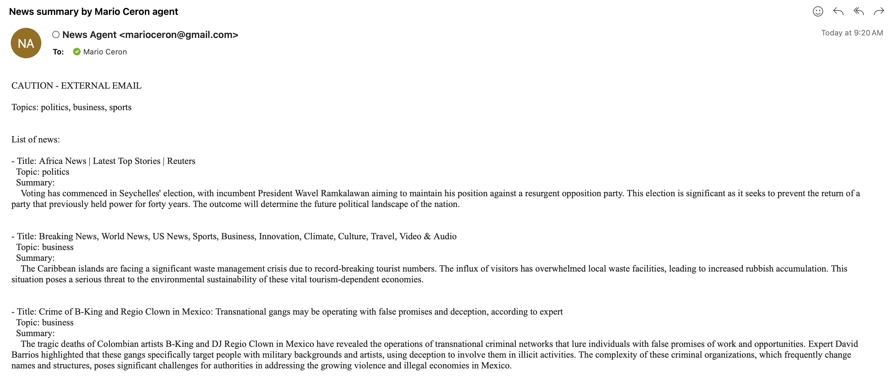
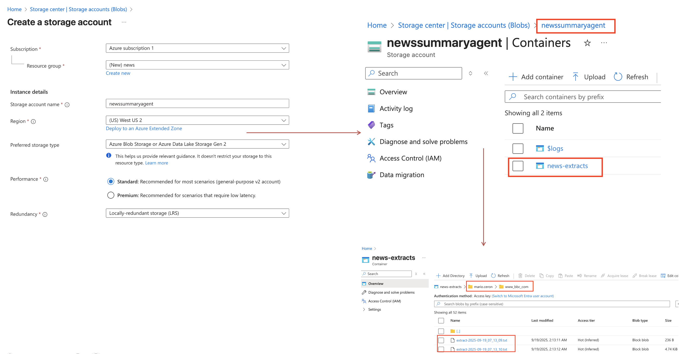

### News Summary Agent

Airflow news agent that scrapes up to 5 links per outlet, stores extracts in Azure Blob, 
filters configured topics, deduplicates with FAISS embeddings, 
summarizes/translates articles, and emails only newly relevant stories. 
Docker Compose setup with a DAG running every 15 minutes.

### News Summary Agent (Airflow + Docker Compose)

A news summary Airflow project that:
1) scrapes news outlets (max 5 links per site),
2) stores raw extracts to Azure Blob Storage under `{user_name}/{web_page}/extract-YYYY-mm-dd_HH_mm_ss.txt`,
3) filters by topics (`INTEREST_TOPICS`), deduplicates via embeddings (FAISS),
4) emails **only new** relevant summaries.

### Quickstart

```bash
# To avoid issues with files
mkdir -p /tmp/mario.ceron/hackathon && chmod -R 777 /tmp/mario.ceron/hackathon
git clone https://gitlab.endava.com/Mario.Ceron/news-summary-agent.git
cd news-summary-agent
cp .env.example .env
# Edit .env with the variables: list of news outlets, SMTP, Azure and OPENAI_API_KEY

# LIST_NEWS_OUTLETS=https://www.reuters.com;https://www.bbc.com/sport;https://www.eltiempo.com`
# SEND_TO=mario.ceron@endava.com
# INTEREST_TOPICS=politics;business;sports
# USER_NAME=mario.ceron
# YOUR_NAME_FOR_SUBJECT=Mario Ceron 
# Azure Blob Storage: (AccountName=datahackathon2025)
# AZURE_STORAGE_CONNECTION_STRING=DefaultEndpointsProtocol=https;AccountName=...;AccountKey=...;EndpointSuffix=core.windows.net
# AZURE_CONTAINER_NAME=datanews

# SMTP:
# SMTP_HOST=smtp.gmail.com
# SMTP_USE_SSL=true
# SMTP_USE_TLS=false
# SMTP_PORT=465
# SMTP_USER=your_user@gmail.com
# SMTP_PASSWORD=your_password_for_application
# EMAIL_FROM="News Agent <my_account@gmail.com>"
# OPEN AI:
# OPENAI_API_KEY=sk-...
# OPENAI_TRANSLATE_MODEL=gpt-4o-mini
# Airflow:
# AIRFLOW_USERNAME=admin 
# AIRFLOW_PASSWORD=admin
# Translation:
# TOPIC_SIM_THRESHOLD=0.20
# STATE_DB_URL=postgresql+psycopg2://admin:admin@db:5432/airflow
# Persist State: Airflow Database State path
# HOST_STATE_DIR=/tmp/mario.ceron/hackathon

# Build Image : takes time...
docker compose up --build
docker compose up -d

# if already run and want to update
docker compose build --no-cache
docker compose up

# Start the database
docker compose exec airflow airflow db init

#check logs of execution
docker compose logs --tail 500 airflow

# Check database is running
docker compose exec airflow airflow db check
# enter to the database
docker compose exec airflow airflow db migrate

# to stop container
docker compose down -v
# to prune the images and containers
docker builder prune -af
docker volume prune -f
 
```
  
### Data Pipeline:



### Airflow:
Open Airflow at http://localhost:8080
 user= admin
 pass = admin
At the UI select Timezone: UTC -5 (local time)

### DAG structure:

The DAG tasks in sequence are:
```
    cfg = load_config()
    _init = init_state()
    scraped = scrape(cfg)
    _stored = store_to_azure(cfg, scraped)
    relevant = select_relevant(cfg, scraped)
    unique = deduplicate_and_only_new(relevant)
    summarized = summarize_for_email(cfg, unique)
    send_email(cfg, summarized)
```


The DAG runs every 15 minutes or trigger manually.

---

### News Summary Agent

### 1) Web scraping functionality
- In Airflow logs for task `scrape`, see up to 5 links per site and `is_article_like=True` counts.

### 2) Storing results in Azure Storage
- In logs for `store_to_azure`, see blob paths; also check your container:  
  `mario.ceron/www_reuters_com/extract-YYYY-mm-dd_HH_mm_ss.txt` (dots & slashes replaced).

### 3) Email sent with news summaries
- Check inbox for Subject: **“News summary by Mario Ceron agent”** with the rendered body, and translated to English if the source is in Spanish.

### 4) Email topics correspond to configured list
- The email lists only items labeled to one of: `politics`, `business`, `sports`.

### 5) Deduplication
- The same story from multiple outlets appears only once. 

### 6) Only newly identified articles
- Trigger the DAG again within ~15 minutes: previously processed stories won’t be emailed again thanks to `state.db`.

---

### Repository directory structure:
```bash
## Directory structure:
├── airflow_home
│   ├── dags
│   │   └── news_dag.py
│   ├── include
│   │   ├── email_template.txt.j2
│   │   └── topics_seed.json
│   └── modules
│       ├── dedupe.py
│       ├── emailer.py
│       ├── news_topics.py
│       ├── scraper.py
│       ├── state.py
│       ├── storage.py
│       ├── summarizer.py
│       ├── translator.py
│       └── utils.py
├── docker-compose.yml
├── Dockerfile
├── README.md
├── requirements.txt
└── .gitignore

# Details per file:
- airflow_home/dags/news_dag.py: 
  Defines the main Airflow DAG for the automated news scraping, summarization, and email pipeline.
- airflow_home/include/email_template.txt.j2: 
  Jinja2 template for rendering the email subject and body sent to users.
- airflow_home/include/topics_seed.json: 
  Seed file containing a list of news topics for initial configuration or onboarding.
- airflow_home/modules/dedupe.py: 
  Provides functions for article deduplication using embeddings and FAISS similarity search.
- airflow_home/modules/emailer.py: 
  Handles email rendering and sending via SMTP, including template processing.
- airflow_home/modules/news_topics.py: 
  Contains logic and data structures for managing and matching news topics: Not used
- airflow_home/modules/scraper.py: 
  Implements web scraping utilities to extract article links and content from news sites.
- airflow_home/modules/state.py: 
  Manages persistent state and metadata using a PostgreSQL database for tracking processed articles.
- airflow_home/modules/storage.py: 
  Intended for Azure Blob Storage operations for storing article extracts.
- airflow_home/modules/summarizer.py: 
  Provides functions to summarize news articles using OpenAI or fallback methods.
- airflow_home/modules/translator.py: 
  Handles language detection and translation of articles to English using OpenAI.
- airflow_home/modules/utils.py: 
  Utility functions for hashing, timestamping, domain normalization, and directory management.
- docker-compose.yml: 
  Defines multi-container Docker services for running the project, including Airflow and dependencies.
- Dockerfile: 
  Specifies the build instructions for the main project Docker image.
- README.md: 
  Project documentation and usage instructions.
- requirements.txt: 
  Lists Python package dependencies required for the project.
- .gitignore: 
   Specifies files and directories to be ignored by Git version control.

```

---

### Useful container commands:
Once created the container, use:
```
docker compose stop
docker compose start
```
```
# List containers:
docker ps
CONTAINER ID   IMAGE                        COMMAND                  CREATED          STATUS          PORTS                                       NAMES
e28d9f5ba43b   news-agent-airflow:latest    "/usr/bin/dumb-init …"   3 minutes ago    Up 3 minutes    0.0.0.0:8080->8080/tcp, :::8080->8080/tcp   news-agent-airflow

# See status: 
docker compose ps
# Tail logs: 
docker compose logs airflow | tail -n 500

# Check Logs inside the container live:
grep -nE "ERROR|Exception|Traceback|Failed|OperationalError|AuthenticationError" /opt/airflow/logs/* -R

# Enter to the container:
docker exec -it news-agent-airflow bash
# check database SQLite: 
sqlite3 airflow.db
.tables
.schema articles
SELECT COUNT(*) FROM articles;
# To clear articles : fresh start
DELETE FROM articles;
SELECT COUNT(*) FROM meta;
SELECT COUNT(*) FROM seen_urls;
.quit

# Check STATE Database
docker exec -it news-agent-airflow bash
cd ..
cd ..

cd state
sqlite3 state.db 
.tables
articles  meta 
SELECT * FROM articles LIMIT 10;
SELECT * FROM meta LIMIT 10;

.schema articles
CREATE TABLE articles (
        id INTEGER PRIMARY KEY,
        url TEXT UNIQUE,
        url_hash TEXT UNIQUE,
        title TEXT,
        source TEXT,
        first_seen_ts INTEGER,
        embedding_id INTEGER,
        duplicate_of INTEGER
    );

.quit
```
### Required env vars
```bash
LIST_NEWS_OUTLETS (semicolon-separated URLs)

SEND_TO (email recipient)

INTEREST_TOPICS (e.g., politics;business;sports)

USER_NAME  
YOUR_NAME_FOR_SUBJECT

Azure: either AZURE_STORAGE_CONNECTION_STRING + AZURE_CONTAINER, or AZURE_STORAGE_ACCOUNT + AZURE_STORAGE_KEY + AZURE_CONTAINER

SMTP: SMTP_HOST, SMTP_PORT, SMTP_USER, SMTP_PASSWORD, EMAIL_FROM, SMTP_USE_SSL, SMTP_USE_TLS

Airflow:

OPENAI_API_KEY
OPENAI_TRANSLATE_MODEL

HOST_STATE_DIR

STATE_DB_URL=postgresql+psycopg2://admin:admin@db:5432/airflow


Note:
On MacOS, using Rancher Desktop, for the Docker Compose command, create:
mkdir -p /tmp/mario.ceron/hackathon && chmod -R 777 /tmp/mario.ceron/hackathon
```
---

### Persistence

A host volume mapped to `/state`, which stores:

`state.db` (seen articles & metadata: PostgreSQL Database)

Bind mounts to `/tmp/mario.ceron/hackathon` by default per `.env` file var: (HOST_STATE_DIR).

---
### Tests - More List News Outlets:

#### English (general, politics, business)

AP News: https://apnews.com

The Guardian (World): https://www.theguardian.com/world

The Guardian (Business): https://www.theguardian.com/business

Al Jazeera: https://www.aljazeera.com

CNBC World/Business: https://www.cnbc.com/world/

Financial Times (paywall): https://www.ft.com

Bloomberg (paywall): https://www.bloomberg.com

#### English (sports)

ESPN: https://www.espn.com

Sky Sports: https://www.skysports.com

#### Spanish (Colombia/LatAm)

El Espectador (general): https://www.elespectador.com

Portafolio (business, Colombia): https://www.portafolio.co

La República (business, Colombia): https://www.larepublica.co

El País (España): https://elpais.com

Marca (sports, ES): https://www.marca.com

AS (sports, ES): https://as.com

---

*Email Example:*



---

*Azure Blob Storage Container Example:*



---
### Configuration Files Details:
### Email Template Format Used:
*include/email_template.txt.j2*
```
Subject: News summary by {{ your_name }} agent

Topics: {{ topics|join(", ") }}


List of news:

- Title: {{ it.title }}
  Topic: {{ it.topic }}
  Summary:
    {{ it.summary }}



No new relevant news this run.

```
---
### Topics Seed (not used):
*include/topics_seed.json*
```
["politics", "business", "sports", "general"]
```
---
### Python Libraries Used:
*requirements.txt*
```python
requests==2.32.3
beautifulsoup4==4.12.3
readability-lxml==0.8.1
lxml==5.3.0
lxml_html_clean==0.2.0
tldextract==5.1.2
python-dateutil==2.9.0.post0
azure-storage-blob==12.22.0
jinja2==3.1.4
sentence-transformers==2.7.0
numpy==1.26.4
pydantic==2.9.1
openai==1.45.1
msal==1.31.0
psycopg2-binary==2.9.9
sqlalchemy==1.4.54
```
---
### Recording Demo:
[Click here to Watch the video](images/recording_demo.mp4)
